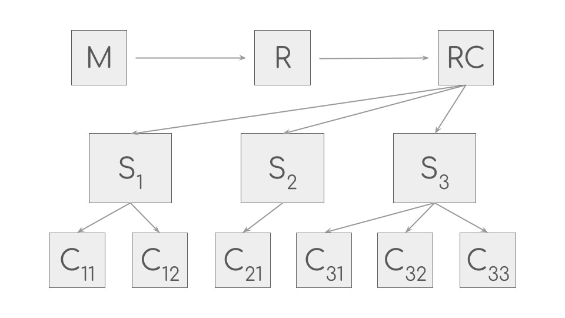
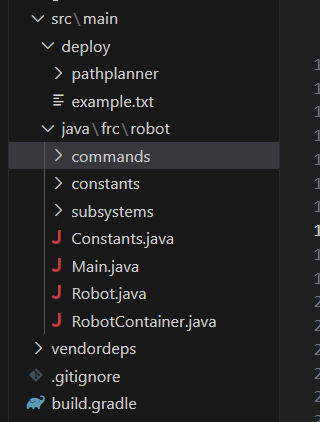

# Code Structure Basics   
### (e.g. how does our code run?)   

In one picture, this is how our code structure looks:

In multiple words, our code structure uses commands and subsystems to try and mimic the real world robot. 

## File Overview

When opening any WPILib project, the basic layout looks a little like this:

where almost anything above the `src/main` folder or below the `vendordeps` folder can be safely ignored (these are usually simulation-related folders or other small folders that help VSCode/WPILib but don't matter too much). 

Taking stock at what we have, in the `vendordeps` folder, we have the vendor dependencies for WPILib, which can be thought of as imported classes for motor controller or other functionality. Instead of coding a motor from scratch, we can use the motor controller built-in to the motor (like with a Falcon 500 motor and the TalonFX controller) or the external motor controller (like with a SparkMax controller for a Neo motor).

Above that folder, we have the `src/main` folder, which is where our code usually lives. The folder `src/main/deploy` is auto-generated and we don't really worry about that, so essentially everything of value is in the `src/main/java/frc/robot` folder.

---

## (Basic) Code Architecture

As mentioned previously, our code uses commands and subsystems to try to mimic the real world robot. What this translates to structure-wise is this:    
- **Subsystems** can be thought of as physical parts of the robot. Example subsystems would be the `Arm` Subsystem, the `SwerveDrive` Subsystem, the `Intake` Subsystem, and so on. Also, note that **subsystems** are not executable/runnable commands and have no inherent functionality -- rather, **subsystems** act as interfaces between the commands we run (in the `commands` folder) and the actual robot.     
- **Commands** can be thought of as the actions a robot takes. For example, an `Arm` Subsystem might have the `MoveArmUp` command, the `TrapezoidalMoveArm` command, the `ArmScorePiece` command, and so on. Commands are what the code calls if it wants something to be done.     
It is worth noting that each Subsystem can only run one command at a time -- for example, if the `Elevator` subsystem is running the `MoveUp` command and hasn't finished, without proper overriding, the `MoveDown` command or any other elevator command would not be able to run until the `MoveUp` command was done executing.          
- **RobotContainer** (`RobotContainer.java`) can be thought of as the final assembly of the robot. In the same way that Fabrication has to assemble all the subsystems -- the `Arm`, the `Elevator`, the `SwerveDrive` (chassis), etc. -- into one robot, `RobotContainer.java` serves as the main assembly for the code and is where all the `Subsystems` and `Commands` are actually *initialized* and bound to joysticks.

---

## Execution Structure/Logic (Approximate)

Hijacking the opening picture, our code generally runs like this:

We start in the top left with the box with an "M" that represents `Main.java`. Like most java programs, this is the first and only java file that is called to run, and this happens when the robot first connects to the RIO. If we take a look inside [`Main.java`](https://github.com/Aragon-Robotics-Team/frc-2025/blob/main/src/main/java/frc/robot/Main.java) however, nothing interesting happens -- `Main.java` makes a robot base and essentially runs whatever's in `Robot.java` (thus the arrow from M to R in the picture). 

`Robot.java` is not as boring but also doesn't give much insight. Primarily, `Robot.java` is used as a way for our code to communicate with the NI Driver Station Application -- for example, the `Autonomous Periodic` method is what's called when we are enabled and in the Autonomous Mode/Tab in our Driver Station.     
Taking a look at the code in [`Robot.java`](https://github.com/Aragon-Robotics-Team/frc-2025/blob/main/src/main/java/frc/robot/Robot.java), it's not too interesting -- there's some logging initialization and some basic scheduling. Moreover, `Robot.java` initializes a `RobotContainer` object and basically runs the code in `RobotContainer.java` (the "RC" box in the top right in the picture above).

`RobotContainer.java`, like mentioned above, can then be thought of as the assembly of our code -- where all our code comes together.    
Broadly, when initialized, [`RobotContainer.java`](https://github.com/Aragon-Robotics-Team/frc-2025/blob/main/src/main/java/frc/robot/RobotContainer.java) first initializes all the subsystems, then initializes all the commands, and finally binds commands to joystick triggers/buttons/axes. Note that each commands needs a subsystem as an argument in its constructor which is why there are arrows from each Subsystem (S1, S2, S3) to the appropriate command (C11, C12, ...).

---

## Miscellaneous

Some other things about code structure (that weren't mentioned previously):      

- Sometimes, if an error gets really bad, you're going to need to fix some error in the `build.gradle` file and usually, changing the version is the way to go (e.g. switch `202x.2.1` to `202x.3.1`).    
- The constants folder just has files with constants in it (e.g. `DriveConstants.java`, `ArmConstants.java`). That's just to make things neater so not all the constants are in a massive `Constants.java` file.
- See [Code Architecture](Code_Architecture.md) for some more info on how exactly code is structured.

