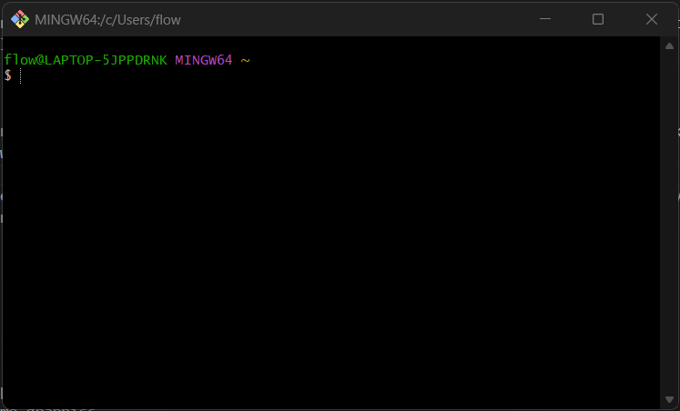

# Git Basics      
### Version Tracking for Code     

Git is a universally used tool made about 20 years ago by Linus Torvalds. Git allows users to sync their code with that held with previous versions and allows collaboration between programmers.

## Key Terms
**Git:** A commonly used version control software.     
**Git Bash:** A terminal in which to run git from. Open on windows by pressing the `[Windows]` key, typing in `"git bash"`, and hitting enter. You should end up with something like this:       

Here, note that the stuff before the at (@) sign is the name of the user on the computer (for me, `flow`), and the stuff after the at sign is the name of the computer (for me, `Laptop-5JPPDNRK`).

**Github:** A place to store repositories (repos), or projects. Note that github is not the only place where repositories can be stored, it is simply the most common place. While git is open source, github is run by Microsoft.      
**Github Desktop:** A GUI alternative to git.

---

## Basic Usage

---

## Other Notes

---

## Practice  
<practice using git!>

---

todo:    
- maybe add hyperlinks and stuff      
- maybe add some graphics
