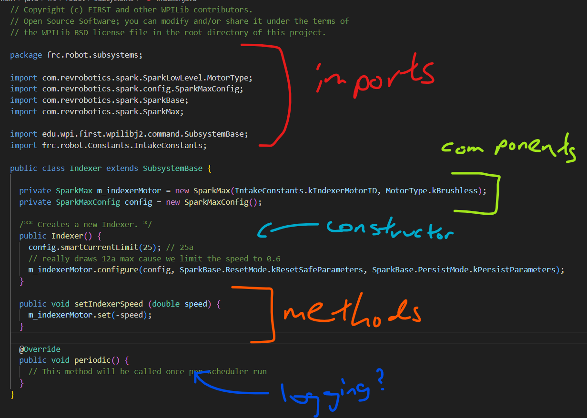

(In the interest of making you guys work out the details and actually code, I am not going to flesh out everything exactly here).   

# Subsystem Outline
### aka How to Code A Subsystem

Let's make a subsystem! This example will make some kind of arm subsystem but most subsystems are pretty similar.       
Note that this is an intro-level doc.

## Preliminaries

Before doing any actual coding, it's good to know:    
1. what the subsystem you're coding *does*     
2. what sensors/actuators are related to your subsystem (neo 550 connected to a sparkmax? limit switch? etc.)

Also, at this step, the brainstorming step basically, you should scope out what you want to be part of your subsystem; remember that subsystems should correspond to physical parts of the robot!

As an example, take a generic `Arm` Subsystem. First, to define scope, we must figure out what the Arm as a whole can do -- for example, if our arm has a telescoping elevator on it connected to a differential 2 degree of freedom (dof) wrist that is meant to operate independently of our arm (see 2910 2025), it would make sense to limit the `Arm` subsystem to really only be the motors controlling the arm. As another example, if the hypothetical arm has an intake attached to it but also some sensor to detect april tags on the arm, it may help to include that april tag sensor in our `Arm` Subsystem and delegate the rest to a separate `Intake` Subsystem. Or it might not. It all depends on use case.        
For this example `Arm`, I'll assume there's some sort of `Encoder` tracking where the arm is, a rev motor (controlled by a `SparkMax`) to move the arm, and the arm is simply supposed to move from position to position.

## Code Structure

Take a look at a Subsystem and more specifically, its code structure.

